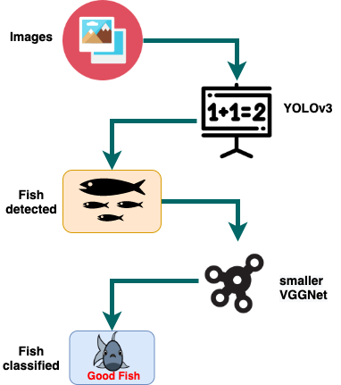

# Fish Species Classification
This is a computer vision project design to identify the species of fish from the images provided to it.<br>
Fish Species Classification's architecture consists of <b>YOLOv3</b> for fish detection and <b>smaller VGGNet</b> 
for their species classification. Most part of the code are copied and modified from <b>Anton Muehlemann (2019)</b> and 
<b>Adrian Rosebrock (2016)</b>for the YOLOv3 and VGGNet respectively.


In this Readme file I will walk you through to head start the project.

## Getting Started
General idea of the project looks like this. <br />


You need to download some basic prerequisites to run this project.

### Prerequisite

1. Git clone FishSpeciesClassification project in your workstation<br />
    Run this command in your terminal.<br />
    ```git clone https://github.com/Dipesh8Bhatta/FishSpeciesClassification.git```
2. Install Python 3 + 
3. Install all the packages in the requirement file.
    ```FishSpeciesClassification >> requirements.txt```

### Download Weights
After prerequisite installation, we need to download the pre-trained weights. There is a directory called **_Data_**, 
inside there is another directory called **_Model_Weights_**. Here, you need to 
add weights for YOLOv3 and smaller VGGNet which are trained on under two different sizes of dataset.

* Category 1
    * YOLOv3 weight trained on 110 annotated fish images.
    * Smaller VGGNet trained on 4 classes of fish.
* Category 2
    * YOLOv3 weight trained on 1000 annotated fish images.
    * Smaller VGGNet trained on 20 classes of fish.

### Manage your images to test
Gather images, you want to use for classification. To identify fish species in those images, you can either put them 
into the location **_Data >> Source_Images >> Test_Images_** or you can directly provide the path while running the 
command line for execution.

### Ready to Run
You are ready run this program. Run this command in your terminal.
```Python main_controller.py 'image_path'```

Or just use this command if you have already stored the images in _Data >> Source_Images >> Test_Images_.<br />
```Python main_controller.py```

###Result
Now, you will see the result in a pop window, showing information about the classified fish image. You can hover your 
cursor in the pop up window and press any key to view next result.<br />
  

<p>References:
    <ul>
        <li>Anton Muehlemann, 2019, <i>TrainYourOwnYOLO</i>, Github.com, retrieved 1 May 2020 
        &lt;https://github.com/AntonMu/TrainYourOwnYOLO&gt; </li>
    </ul>
    <ul>
        <li>Adrian Rosebrock, 2016, <i>Keras and Convolutional Neural Networks (CNNs)</i>, Pyimagesearch, retrieved 7 
        April 2020 &lt;https://www.pyimagesearch.com&gt; </li>
    </ul>
</p>
